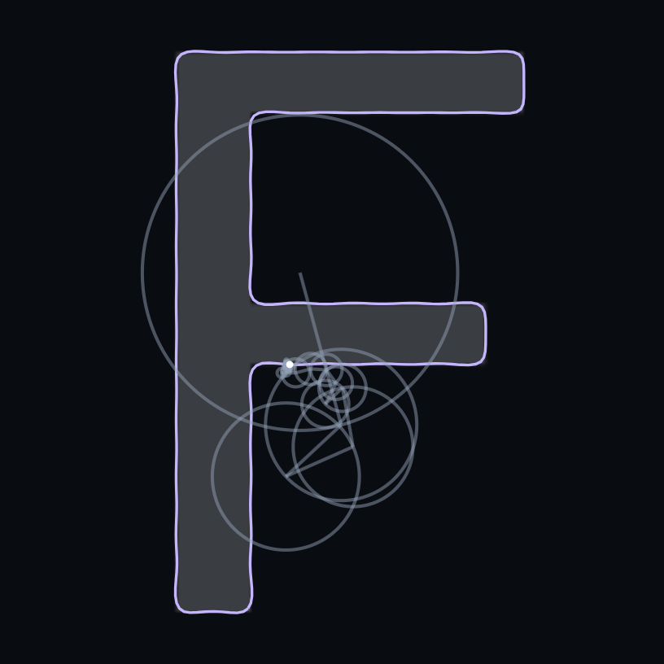

# Font Fourier Epicycles

[Open demo / デモを開く](https://akeit0.github.io/FontFourier/) · [GitHub](https://github.com/akeit0/FontFourier)

[English](#english) · [日本語](#日本語)



*F · Roboto · Fourier order 40*

## English

Explore font outlines as rotating circles and stereo sound. A complex Fourier series reconstructs each contour, using the same coefficients for the animation and audio.

Choose text and a font to view their epicycles. Select **Play** or press Enter in the text field to start audio. Settings provides controls for Fourier order, animation, and sound. The UI supports English and Japanese.

Audio can play the Fourier waveform directly or map each contour to the pitch of a sine tone.

To run locally, open `index.html` in your browser. An internet connection is required for fonts and contour analysis. Font requests to Google Fonts include the selected family, weight, and text.

## 日本語

文字の輪郭を、回転する円とステレオ音声で楽しむデモです。複素フーリエ級数で各輪郭を再構成し、同じ係数をアニメーションと音声に使います。

文字とフォントを選ぶと、エピサイクルを表示します。**再生** または文字欄のEnterで音声を再生できます。設定からフーリエ項数・アニメーション・音声を調整でき、UIは日本語と英語に対応しています。

音声は、フーリエ波形をそのまま鳴らす方式と、輪郭ごとの波をsin音の音高に対応させる方式を選べます。

ローカルでは `index.html` をブラウザで開いてください。フォントと輪郭解析の読み込みにインターネット接続が必要です。Google Fontsには選択したフォント名・ウェイト・文字列が送信されます。

## Development

Node.js 24 or later:

```sh
npm ci
npx playwright install chromium
npm run dev
```

- `npm test` — browser tests
- `npm run check` — syntax, translations, and assets
- `npm run build` — static site in `_site/`
- `npm run thumbnail` — cropped F at Fourier order 40

## License

Original code: [Unlicense](LICENSE). Third-party libraries and fonts retain their [respective licenses](THIRD_PARTY_NOTICES.md).

独自コードは [Unlicense](LICENSE) です。第三者ライブラリ・フォントには[それぞれのライセンス](THIRD_PARTY_NOTICES.md)が適用されます。
